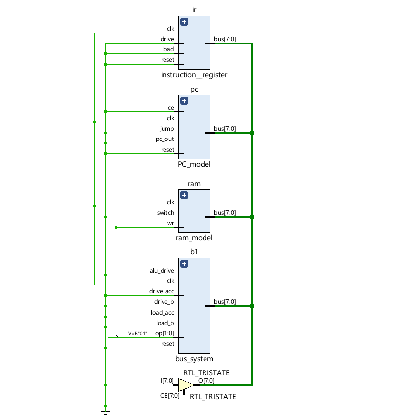
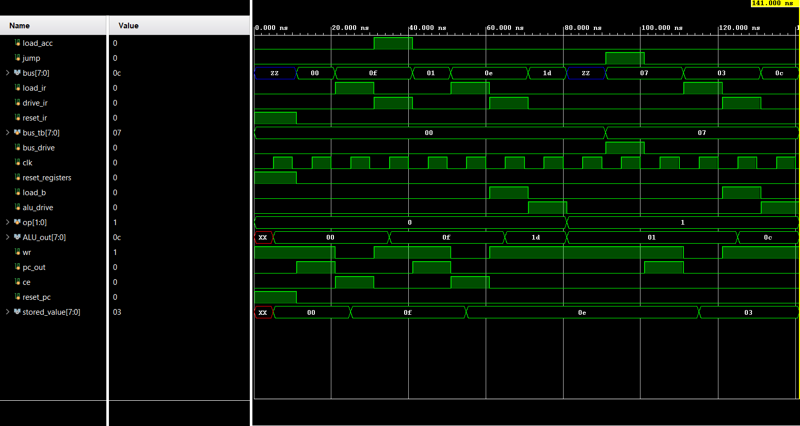

# Working Datpath without Control Unit

Made a full manually-controlled datapath which connects 5 different modules that passes and stores 8-bit information, implemented and verified in Vivado

## Modules 
|**Module Name**|**Function**|
| :--- | :--- |
|Program Counter|`pc_model` increments the 4-bit address by 1 bit each time the count_enable function is on.It gives instruction to the RAM as to which memory element is currently needed.|
|Random Access Memory|`ram_model` is a 16x8-bit synchronous memory storage RAM which enables us to store 16 elements of 1 byte (8bits) each.|
|Instruction Register|`instruction_register` captures the data that was passed to the bus by RAM and then stores it for as long as needed.|
|Bus System| `bus_system` is a system consisting of two registers and an ALU with an always-live wire that gets activated with `alu_drive`. The two register are `ACC` and `B`.The `Accumulator(ACC)` register accumulates the result passed by the ALU and also acts as an operand for the ALU, whereas the `B` register here only acts as an operand.|
|Arithmetic Logic Unit| The `ALU` is the unit which handles the arithmetic operations such as add,subtract,multiply and division. It gives the result on an always-live wire which drives the bus whenever needed.|

## Remarks:
The Datapath is fully controlled by the user using testbenches written in verilog. For now, this module doesnt use a control unit and lets us decide what happens when. In the upcoming work, a `**Finite State Machine (FSM)**` called the `**Control Unit**` will handle what sequence comes next.

## Schematic

## Simulation Results

